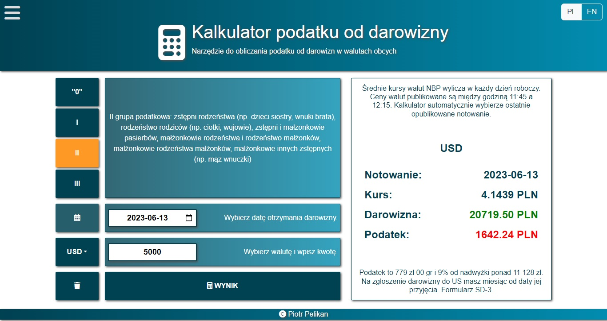

# Foreign currency donation calculator

it's easy-to-use tool to calculate donation and tax in PLN.

## Visuals



## Installation

Use the package manager to install and run app

```npm
npm i
npm start
```

## Usage

Let's check how it works!

https://pio-pel.github.io/

## Description

RCDC it's a easy-to-use tool.

1. Choose tax group right for you (see description next to buttons)
2. Select date when you received your donation
3. Select currency
4. Enter donation amount
5. Click "Count" to get result

On the other pages you can find an information and watch a movies about donations, taxes and how to fulfill necessary forms.
